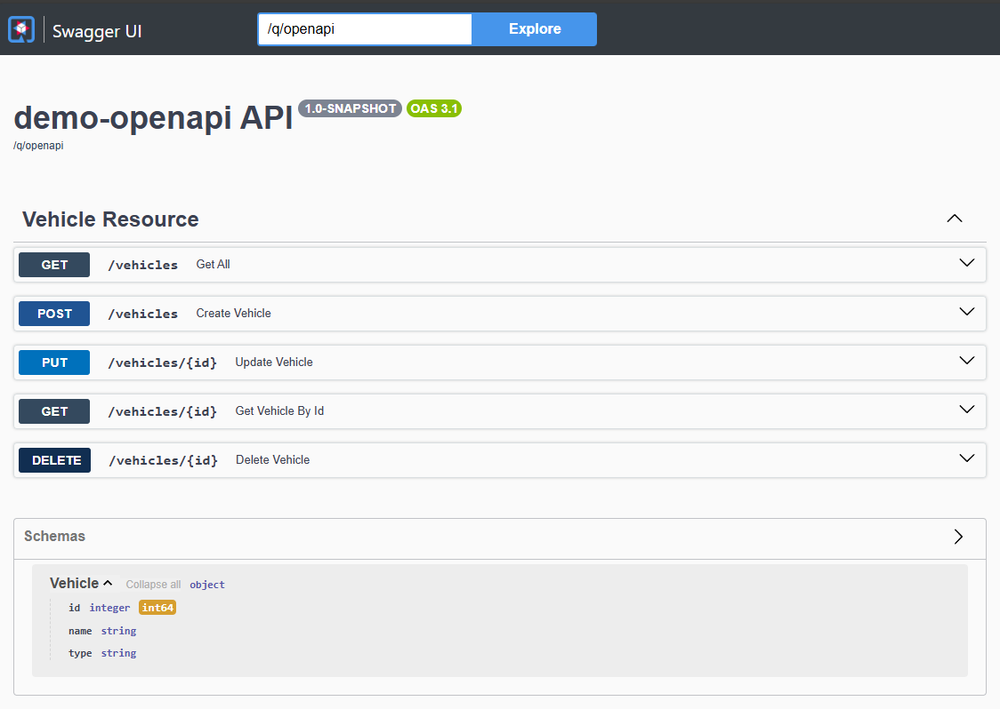

:author: Erik Seifried
:email: e.seifried@students.htl-leonding.ac.at
:revnumber: 1.1
:revdate: {docdate}
:revremark: OpenAPI und Swagger @ HTL Leonding
:encoding: utf-8
:lang: de
:doctype: article

= OpenAPI und Swagger

[.text-center]
====
image::images/Swagger-Logo.png[width=450, height=450, alt="Swagger Logo"]

*Eine Einführung in OpenAPI und Swagger*

[.small]
Erik Seifried | HTL Leonding
====

image::images/Referat-Ablauf.png[]

== Einführung: Was ist eine API?
=== Der Vertrag zwischen zwei Systemen:
Eine API (Application Programming Interface) ist wie ein Vertrag zwischen 2 (oder mehreren) Systemen. Sie legt fest, wie die Systeme miteinander kommunizieren und welche Informationen ausgetauscht werden.

=== Restaurant Beispiel:
image::images/Restaurant.png[]

- Die API sorgt dafür, dass der Austausch von Informationen standardisiert abläuft.
- Das bedeutet, dass die Informationen in einem festgelegten Format *JSON* oder *YAML* übermittelt werden.
- Im Restaurant-Beispiel könnte man dies mit der Sprache vergleichen, die alle Beteiligten Sprechen (Annahme: Alle sprechen Englisch).

== Was ist OpenAPI und welche Alternativen gibt es?
image::images/OpenAPI Initiative.png[]
=== OpenAPI im Überblick:
- OpenAPI ist ein Standard zur Beschreibung von Programmierschnittstellen
- Früher bekannt als "Swagger"

[.text-center]

=== Alternativen zu OpenAPI (2 Beispiele):

- GraphQL: 2015 von Facebook entwickelt (Open Source)

*Hauptunterschied zwischen GraphQL und REST:*

- GraphQL: Der Client bestimmt, welche Daten er benötigt → eine flexible Anfrage, eine Antwort.

- REST: Der Server definiert feste Endpunkte → mehrere Anfragen nötig, um verknüpfte Daten zu erhalten.

*Hauptunterschied zwischen gRPC und REST:*

- gRPC: 2015 von Google entwickelt (Open Source)

- Bei gRPC ruft eine Komponente (der Client) bestimmte Funktionen in einer anderen Softwarekomponente (dem Server) auf. Bei REST ruft der Client keine Funktionen auf, sondern er fordert Daten vom Server an oder aktualisiert sie.

== Welches Problem löst OpenAPI?
image::images/Welches_Problem_löst_OpenAPI.png[]

Wenn man eine REST-API hat kann niemand zu diesem Server hingehen und fragen: "Was kannst du eigentlich?".

- Welche Endpunkte gibt es?
- Welche HTTP-Methoden (GET, POST, PUT, DELETE) kann ich nutzen?
- Welche Datenformate (JSOn, XML) werden erwartet?
- Welche Parameter werden benötigt (Query-Parameter, Path-Parameter, Body)?
- Welche Antwort bekomme ich zurück?

Genau dieses Problem löst OpenAPI: +

image::images/2-Möglichkeiten.png[]

== Schnittstllendokumentation mit der Swagger UI
- Swagger UI ermöglicht es die API-Ressourcen zu visualisieren und mit ihnen zu interagieren.

- Implementierungslogik muss nicht vorhanden sein
- Dokumentation kann automatisch aus der OpenAPI-Spezifikation (YAML-File) generiert werden

=== Wie sieht die Swagger UI aus?

== Schnittstellendokumentation mit der Swagger UI und einer bestehenden Resource

=== 1. OpenAPI-Abhängigkeit in pom.xml hinzufügen

=== 2. Resource erstellen

[.details]
====

====

=== 3. Swagger UI aufrufen

== Resource Interface mit Quarkiverse Server Generator erstellen

=== 1. Quarkiverse Server Generator Dependency hinzufügen

=== 2. OpenAPI Spezifikationsfile (YAML) erstellen

image:images/Intellij-API-Übersicht.png[]

=== 3. Plugin in pom.xml hinzufügen

=== 4. FruitsResource Interface aus dem Quarkiverse Generator erstellen

=== 5. Target-Ordner mit generierten Klassen

=== 6. Verwendung des FruitsResource Interface

== Quellen
https://docs.quarkiverse.io/quarkus-openapi-generator/dev/server.html

video::uwQyXuZZciI[youtube, width=800, height=450]

