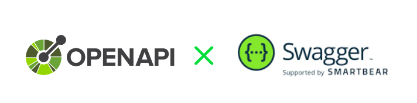

:author: Erik Seifried
:email: e.seifried@students.htl-leonding.ac.at
:revnumber: 1.1
:revdate: {docdate}
:revremark: OpenAPI und Swagger @ HTL Leonding
:encoding: utf-8
:lang: de
:doctype: article

= OpenAPI und Swagger

[.text-center]
====

*Eine Einführung in OpenAPI und Swagger*

[.small]
Erik Seifried | HTL Leonding
====

== Einführung: Was ist eine API?
=== Der Vertrag zwischen zwei Systemen:
Eine API (Application Programming Interface) ist wie ein Vertrag zwischen 2 Systemen. Sie legt fest, wie die Systeme miteinander kommunizieren und welche Informationen ausgetauscht werden.

=== Restaurant Beispiel:

- Der *Client* (Gast) stellt eine Anfrage (Request), ähnlich wie ein Gast im Restaurant eine Bestellung aufgibt. Die *API*, dargestellt durch den (Kellner) nimmt die Anfrage entgegen, überprüft sie und leitet sie an den *Server* (Koch) weiter.
- Der Server verarbeitet die Anfrage und gibt sie über die API zurück an den Client.
- Die API sorgt dafür, dass der Austausch von Informationen standardisiert abläuft.
- Das bedeutet, dass die Informationen in einem festgelegten Format *JSON* oder *YAML* übermittelt werden.
- Im Restaurant-Beispiel könnte man dies mit der Sprache vergleichen, die alle Beteiligten Sprechen

== Was ist OpenAPI und welche Alternativen gibt es?

=== OpenAPI im Überblick:
- OpenAPI ist ein Standard zur Beschreibung von Programmierschnittstellen
- Es lassen sich damit REST-konforme APIs beschreiben, entwickeln, testen und dokumentieren

=== REST:
- Das zentrale Konzept einer Rest-Architektur sind Ressourcen

=== Alternativen:

== Von der Idee zur funktionierenden API

